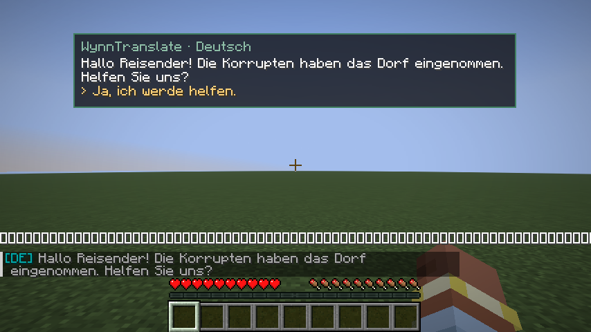
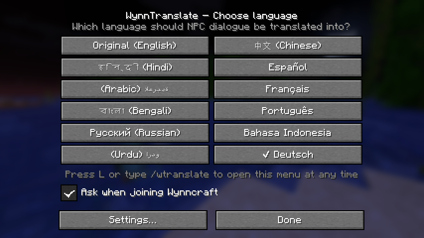

# WynnTranslate

Fabric-Mod für **Minecraft 1.21.11**, der **Wynncraft-NPC-Dialoge live übersetzt**, also die
Gespräche, die man mit Shift weiterklickt. Passend zu **Wynn+** (1.2.0), Wynntils 4.2.x und Lunar Client.





## Funktionen

- **Sprachauswahl beim Betreten von Wynncraft**: Beim Join erscheint ein Fenster mit den Sprachen
  (abschaltbar per Häkchen). Jederzeit wieder erreichbar mit **Taste L**, **`/wtranslate`** oder
  über das Zahnrad in **Mod Menu**.
- **11 Sprachen**: die zehn meistgesprochenen Sprachen der Welt außer Englisch (Chinesisch, Hindi,
  Spanisch, Arabisch, Französisch, Bengalisch, Portugiesisch, Russisch, Indonesisch, Urdu) plus Deutsch.
  Englisch ist die Originalsprache von Wynncraft.
- **Übersetzungs-Kasten** oben, in der Mitte oder unten am Bildschirm, inklusive Antwortmöglichkeiten.
  Zusätzlich optional als Zeile im Chat, damit man nachlesen kann.
- **Erkennt Dialoge in der Aktionsleiste**, so wie Wynncraft sie aktuell anzeigt, und auch das ältere
  Chat-Format `[1/4] NPC: Text`.
- **Zwischenspeicher**: Einmal übersetzte Sätze werden unter `config/wynntranslate/cache/` gespeichert
  und erscheinen beim nächsten Mal sofort, ohne Internetanfrage.
- **Kostenlos ohne Schlüssel** über Google Translate. Optional kann ein eigener
  [DeepL-API-Schlüssel](https://www.deepl.com/pro-api) eingetragen werden, der kostenlose Tarif reicht.
  Für Hindi, Bengalisch und Urdu nutzt der Mod immer Google, weil DeepL diese Sprachen nicht anbietet.
- **Verträgt sich mit anderen Mods**: Nachrichten werden nur gelesen, nie verändert oder
  unterdrückt. Wynntils, Voices of Wynn usw. funktionieren weiter wie gewohnt.

## Installation

Voraussetzung: Fabric Loader ≥ 0.16 und **Fabric API** für 1.21.11. Beides ist in Wynn+ bereits enthalten.

**Wynn+ (Modrinth App, Prism Launcher o. ä.)**
1. `wynn-translate-1.0.0+mc1.21.11.jar` herunterladen.
2. Im Launcher das Wynn+-Profil öffnen → „Ordner öffnen“ → die Jar in den Ordner `mods` legen.
3. Spiel starten und Wynncraft betreten, dann erscheint die Sprachauswahl.

**Lunar Client**
1. Im Launcher links die Version **1.21.11** wählen und das **Fabric**-Profil nutzen.
2. Unten rechts auf das Profil klicken → oben **„Mods“**.
3. Die Jar in das Fenster ziehen. Falls noch nicht vorhanden, auch die
   [Fabric API](https://modrinth.com/mod/fabric-api) für 1.21.11 hinzufügen.

## Bekannte Grenzen

- Die Minecraft-Schrift stellt **Hindi, Bengalisch, Arabisch und Urdu** nur eingeschränkt dar: Buchstaben
  werden nicht verbunden. Das liegt an Minecraft selbst. Chinesisch, Russisch und alle Sprachen mit
  lateinischer Schrift sehen normal aus.
- Maschinelle Übersetzung ist nicht perfekt. Eigennamen wie Orte und NPCs werden manchmal mitübersetzt.
- Die Dialog-Erkennung richtet sich nach den aktuellen Wynncraft-Schriftarten (`hud/dialogue/...`).
  Ändert Wynncraft das Format, muss der Mod eventuell angepasst werden.
- Übersetzt wird nur, was Wynncraft als Text schickt. Die Sprachausgabe von Voices of Wynn bleibt englisch.

## Selbst bauen

```bash
./gradlew build              # Jar liegt danach in build/libs/
./gradlew test               # Unit-Tests (Dialog-Erkennung, Parser)
./gradlew runClientGameTest  # startet Minecraft und testet einen simulierten Dialog
```

Benötigt Java 21. Lizenz: MIT.
